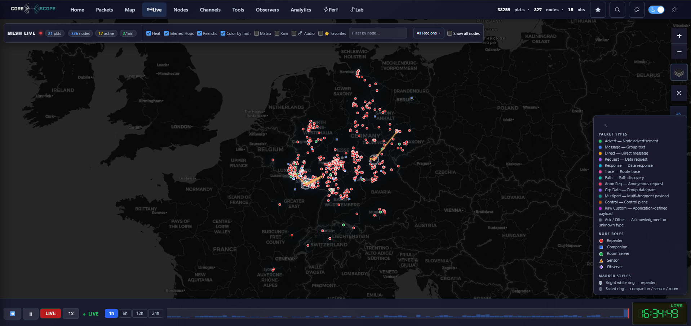
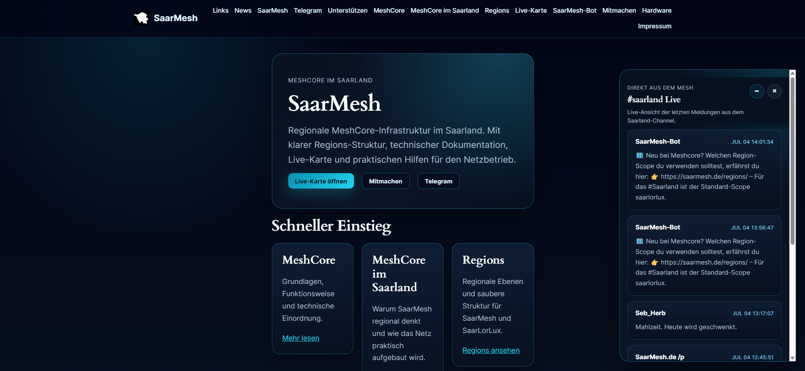
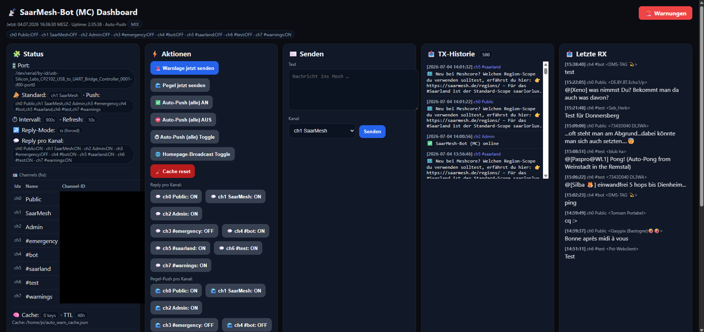

# 🛰️ SaarMesh

Ein öffentliches [MeshCore](https://meshcore.co.uk/) Funknetz für die SaarLorLux-Region (Saarland, Lothringen, Luxemburg).

**🌍 Live-Karte:** [live.saarmesh.de](https://live.saarmesh.de) · **🏠 Projektseite:** [saarmesh.de](https://saarmesh.de) · **☕ Unterstützen:** [ko-fi.com/saarmesh](https://ko-fi.com/saarmesh)

---

## Über das Projekt

SaarMesh ist ein community-getragenes LoRa-Mesh-Netzwerk mit aktuell **800+ Nodes** in der Grenzregion Deutschland/Frankreich/Luxemburg. Das Netz nutzt MeshCore-kompatible Hardware und ermöglicht dezentrale, infrastrukturunabhängige Kommunikation über LoRa-Funk – nützlich für Funkamateure, Outdoor-Aktivitäten und als Backup-Kommunikationsmittel z.B. im Katastrophenschutz.


*Live-Ansicht der Mesh-Aktivität auf [live.saarmesh.de](https://live.saarmesh.de)*

## Netzwerk-Architektur

```
MeshCore Nodes (800+)
        │  LoRa
        ▼
   Gateway-Nodes
        │
        ▼
  CoreScope (live.saarmesh.de)
        │  Caddy Reverse Proxy (TLS)
        ▼
   VPS (bold-wright)
```

Die Live-Karte läuft auf [CoreScope](https://github.com/Kpa-clawbot/CoreScope), einer Open-Source-Visualisierung für MeshCore-Netzwerke. Wir tragen aktiv zu CoreScope bei (siehe unten).

## Projektseite


*Die Projektseite [saarmesh.de](https://saarmesh.de) mit Dokumentation, Regions-Struktur und Live-Feed aus dem #saarland-Kanal.*

## Mitmachen

Du bist im SaarLorLux-Raum und willst mitfunken?

1. MeshCore-kompatible Hardware besorgen (z.B. Heltec, RAK, T-Beam)
2. Frequenzband: **868 MHz (EU)**. Region-Scope: **saarlorlux** (Standard für das Saarland – Details siehe [saarmesh.de/regions](https://saarmesh.de/regions))
3. In Reichweite eines bestehenden Nodes bringen – Abdeckung siehe [Live-Karte](https://live.saarmesh.de)
4. Fragen oder Kontakt: Kanal **#saarland** im Mesh, oder über [Telegram](https://saarmesh.de) (Link auf der Projektseite)

## Projekte & Beiträge

Diese Organisation bündelt Repos rund um SaarMesh und MeshCore:

| Repo | Beschreibung |
|---|---|
| [meshcore-chat](https://github.com/Saarlandpower/meshcore-chat) | Web-Chat-Interface für MeshCore (Flask + SocketIO) |

**Upstream-Beiträge:** Wir arbeiten aktiv an [CoreScope](https://github.com/Kpa-clawbot/CoreScope) mit, u.a. Fixes für Versionsauflösung und Node-Staleness-Handling.

## Tech-Stack

- **Mesh:** MeshCore, LoRa (868 MHz EU)
- **Visualisierung:** CoreScope
- **Infrastruktur:** VPS + Caddy (TLS), Raspberry Pi Gateways
- **Bot-Features:** Wetterabfrage, NINA-Warnkanal, ADS-B-Status im Mesh


*Internes Dashboard des SaarMesh-Bots zur Kanal-Steuerung und Nachrichtenübersicht.*

## Lizenz

<!-- TODO: Lizenz festlegen, z.B. MIT für eigene Repos -->

---

*Betrieben ehrenamtlich aus dem Saarland. Fragen, Feedback und Mitmacher willkommen.*

Wenn du das Projekt unterstützen möchtest (Hardware, Serverkosten): [☕ ko-fi.com/saarmesh](https://ko-fi.com/saarmesh)
